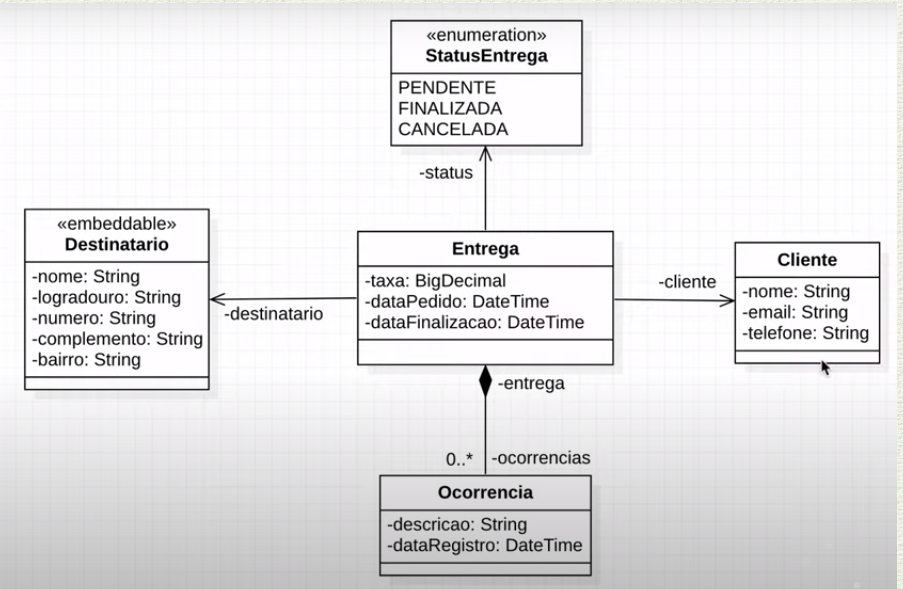

# Spring REST


## 🛠 Tecnologias utilizadas

<div style="display: inline_block">
  
  
  
  
  
  <!-- -->
</div>

### Tópicos 

- [Descrição do projeto](#descrição-do-projeto)

- [Funcionalidades](#funcionalidades)

- [Deploy da Aplicação](#deploy-da-aplicação-dash)

- [Pré-requisitos](#pré-requisitos)

- [Como rodar a aplicação](#como-rodar-a-aplicação-arrow_forward)

 

Insira os tópicos do README em links para facilitar a navegação do leitor

## Descrição do projeto 

- Projeto desenvolvido na semana spring rest



## Funcionalidades

:heavy_check_mark: Funcionalidade 1  

:heavy_check_mark: Funcionalidade 2  

:heavy_check_mark: Funcionalidade 3  

:heavy_check_mark: Funcionalidade 4  

## Layout ou Deploy da Aplicação :dash:

> Link do deploy da aplicação. Exemplo com netlify: https://certificates-for-everyone-womakerscode.netlify.app/

... 

Se ainda não houver deploy, insira capturas de tela da aplicação ou gifs

## Pré-requisitos

- Java 11
- Spring Tools 4 for Eclipse


## Como rodar a aplicação :arrow_forward:

No terminal, clone o projeto: 

```
git clone https://github.com/andresgois/spring-rest.git
```

#### Roda Fast Jar
- Botão direito no projeto
- Run as
- Maven Build
- em Goals coloque *clean package*
    - isso limpa tudo e depois empacota a aplicação    

#### Roda o JAR
- entre na pasta target
```
java -jar nome-do-jar.jar
```

## Como rodar os testes

Coloque um passo a passo para executar os testes

```
$ npm test, rspec, etc 
```

## Casos de Uso

Explique com mais detalhes como a sua aplicação poderia ser utilizada. O uso de **gifs** aqui seria bem interessante. 

Exemplo: Caso a sua aplicação tenha alguma funcionalidade de login apresente neste tópico os dados necessários para acessá-la.

## JSON :floppy_disk:

### Usuários: 

|name|email|password|token|avatar|
| -------- |-------- |-------- |-------- |-------- |
|name|email|password|token|avatar|


## Iniciando/Configurando banco de dados

Se for necessário configurar algo antes de iniciar o banco de dados insira os comandos a serem executados 

## Linguagens, dependencias e libs utilizadas :books:

- [Java](https://docs.oracle.com/en/java/)
- [Spring](https://spring.io/projects)
- [Spring Initializer](https://start.spring.io/)


Liste as tecnologias utilizadas no projeto que **não** forem reconhecidas pelo Github 

## Resolvendo Problemas :exclamation:

Em [issues]() foram abertos alguns problemas gerados durante o desenvolvimento desse projeto e como foram resolvidos. 

## Tarefas em aberto

Se for o caso, liste tarefas/funcionalidades que ainda precisam ser implementadas na sua aplicação

- Tarefa 1 

## Desenvolvedores/Contribuintes :octocat:

Liste o time responsável pelo desenvolvimento do projeto

| [<br><sub>André Gois</sub>](https://github.com/andresgois) |
| :---: 

## Licença 

The [MIT License]() (MIT)

Copyright :copyright: 2022 - Spring REST